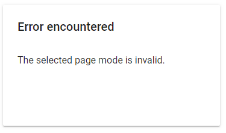
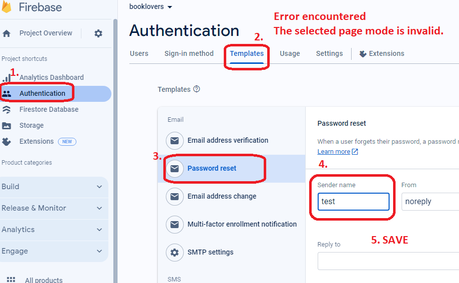
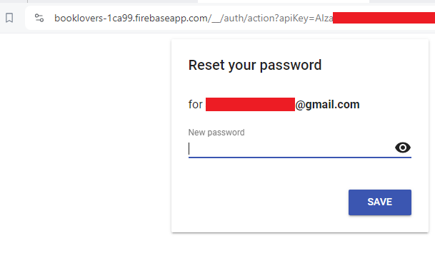
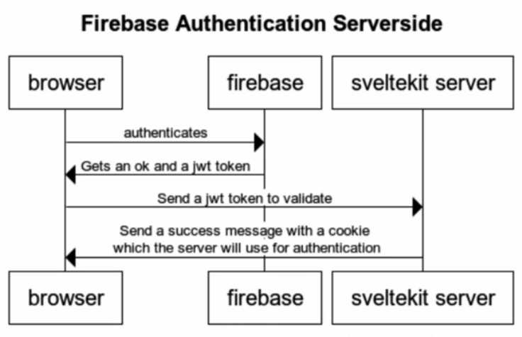
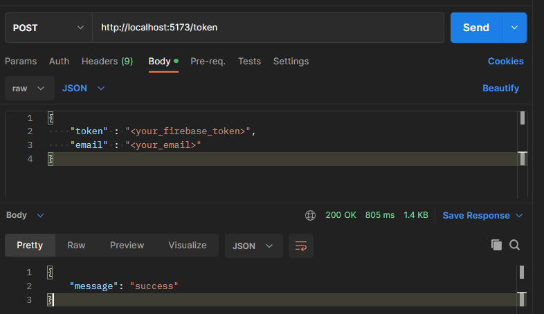
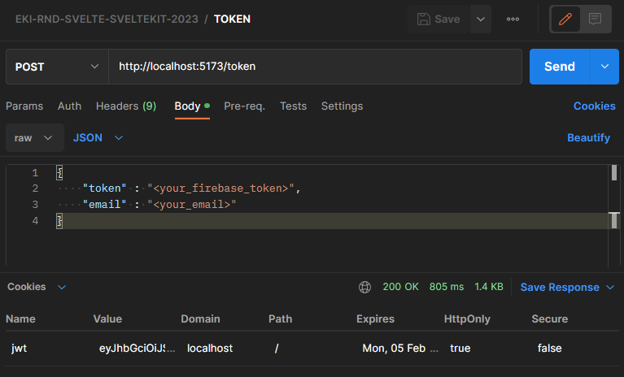

## Tutorial : 

:link: [Udemy](https://www.udemy.com/course/master-svelte-framework-the-complete-course-2023)


<details>
  <summary>EKI-20231205-048-INTRO</summary>

```sh

# ex :
# https://booklovers-theta.vercel.app/
# usr : ekitest@mail.com
# pas : ekitest1@mail.com

```

</details>

<details>
  <summary>EKI-20231205-049-Project-Setup</summary>

```sh
cd eki-rnd-svelte-sveltekit-2023-part-2
npm create svelte@latest booklovers

Which Svelte app template?
- Sekelton project

Add type checking with TypeScript?
- Yes, using Javascript with JSDoc comments

Select additional options (use arrow keys/space bar)

│  ◻ Add ESLint for code linting
│  ◼ Add Prettier for code formatting
│  ◻ Add Playwright for browser testing
│  ◻ Add Vitest for unit testing
│  ◻ Try out Svelte 5 beta

cd booklovers
npm install
npm run dev -- --open

```

</details>


<details>
  <summary>EKI-20231205-050-Firebase-Setup</summary>

```sh

firebase.google.com -> go to console -> create project 
-> "booklovers" 
-> Enable Google Analytics for this project ->
-> Configure Google Analytics -> Analytics location -> "indonesia"
-> use the default setting for sharing Google Analytics data
-> accept

Authentication -> Get Started 
-> Sign-in method
-> Native providers 
-> Email/Password -> Enable
-> Email/Password -> Email link (passwordless sign-in) -> Disable

Authentication ->
-> Add new provider
-> Additional providers
-> Google -> Enable
-> "SECRET DETAIL IN NOTEPAD"

Build -> Firestore Database
-> Create Database
-> Database ID : (default)
-> Location : asia-southeast2 (Jakarta)
-> Start in production mode

Build -> Storage
-> Start in production mode
-> Cloud Storage location : asia-southeast2
-> Done

Project Overview -> Project settings
-> Service accounts
-> Firebase Admin SDK
-> Admin SDK configuration snippet : Nodejs
-> Copy code paste to notepad  (save)
-> Generate new private key [json]  (save)

Project Overview -> Project settings
-> Service accounts
-> Firebase Admin SDK
-> Manage service account permission (untuk melihat account)

after Generate new private key (json) copy to /booklovers/src/lib/firebase/firebase-secrets.server.json

add .gitignore
src/lib/firebase/firebase-secrets.server.json

```

</details>


<details>
  <summary>EKI-20231206-051-Bootstrap-Navbar</summary>

```sh

npm i -D bootstrap@v5.3.2

```

Nav.svelte
```svelte
copy from 
<!-- https://github.com/phptuts/booklovers -->
<!-- https://pastebin.com/raw/04na96qx -->
```

</details>

<details>
  <summary>EKI-20231216-054-Messages</summary>

```sh
# https://github.com/phptuts/booklovers

# Message Store (copy html)

```

</details>


<details>
  <summary>EKI-20231216-055-Initialize-Firebase-Client-Side</summary>

```sh
-> https://console.firebase.google.com/ 
-> booklovers 
-> click </> (web) 
-> Add Firebase to your web app -> Register app -> 
-> uncheck [Also set up Firebase Hosting for this app]
-> Register app
-> Add Firebase SDK
-> use npm -> npm install firebase

```


copy
```js

const firebaseConfig = {
  apiKey: "xxxxxxxxxxxxxxxxxxxxxxxx",
  authDomain: "xxxxxxxxxxxxxxxxxxxxxxxx",
  projectId: "xxxxxxxxxxxxxxxxxxxxxxxx",
  storageBucket: "xxxxxxxxxxxxxxxxxxxxxxxx",
  messagingSenderId: "xxxxxxxxxxxxxxxxxxxxxxxx",
  appId: "xxxxxxxxxxxxxxxxxxxxxxxx",
  measurementId: "xxxxxxxxxxxxxxxxxxxxxxxx"
};


// copy to booklovers\src\lib\firebase\firebase.client.js

```

copy https://github.com/phptuts/booklovers (Firebase Initialize) to .env

.env
```sh
# update env from js code

PUBLIC_API_KEY=
PUBLIC_AUTH_DOMAIN=
PUBLIC_PROJECT_ID=
PUBLIC_STORAGE_BUCKET=
PUBLIC_MESSAGING_SENDER_ID=
PUBLIC_API_ID=
PUBLIC_MEASUREMENT_ID=
PUBLIC_ERROR_MESSAGE="There was an error, please contact support."

# booklovers\src\lib\firebase\firebase.client.js  update code & npm run dev ,  f12
```


install firebase depedency
```sh
npm i firebase -D

update code firebase.client.js
# booklovers\src\lib\firebase.client.js

```


</details>


<details>
  <summary>EKI-20231220-056-Login-with-google</summary>

```sh

# booklovers\src\lib\components\Auth\LoginWithGoogle.svelte
# booklovers\src\lib\firebase\auth.client.js
# booklovers\src\routes\login\+page.svelte


# FOR CHECK USER LOGIN ACCOUNT (USER UID)
# GO TO
# https://console.firebase.google.com/
#
# -> Booklover -> Authentication 


```

</details>


<details>
  <summary>EKI-20240122-059-Register-Email-And-Password</summary>

```sh

# https://github.com/phptuts/booklovers

# Auth Form https://pastebin.com/raw/VkcLcTVG

create file booklovers\src\lib\components\Auth\AuthForm.svelte


https://console.firebase.google.com/ -> Booklovers -> Authentication -> copy email exist
-> Email paste to ->  -> http://localhost:5173/signup


ERROR HANDLE WITH REDIRECT + NOTIF :

      # booklovers\src\lib\components\Auth\LoginWithGoogle.svelte
			await goto('/'); // fix success login redirect
			return;

      # booklovers\src\routes\signup\+page.svelte
      await goto('/login'); // fix success register redirect login
			return;

      # booklovers\src\routes\signup\+page.svelte
      iff (e.code === 'auth/email-already-in-use') {
				messagesStore.showError('You Have already registered, please log in.');
				await goto('/login');
				return;
			}

			if (e.code === 'auth/weak-password') {
				messagesStore.showError('weak password!, please try again');
				await goto('/signup');
				return;
			}

			if (e.code === 'auth/missing-password') {
				messagesStore.showError('missing password, please try again');
				await goto('/signup');
				return;
			}

			con


```

</details>


<details>
  <summary>EKI-20240126-060-Login-with-email-and-password</summary>

```sh
# https://console.firebase.google.com

# check register/login user pass

```

</details>


<details>
  <summary>EKI-20240126-061-Forgot-Password-Workflow [INPROGGRESS]</summary>

```sh

# http://localhost:5173/forgo-password


# console.log(firebaseConfig) // API KEY ISSUE FOR FORGOT PASSWORD
# https://stackoverflow.com/questions/64343788/firebase-email-link-authentication-leads-to-a-page-that-says-error-encountered
# https://booklovers-1ca99.firebaseapp.com/__/auth/action?mode=resetPassword&oobCode=XWEDWsatBq1iLg4pzGvaouACwSRjt0t5R0OaQgL6BlEAAAGNRT6bsQ&apiKey=&lang=en
# perlu makesure https://console.firebase.google.com -> Auth -> Templates
# expetation : https://test-auth-79dae.firebaseapp.com/__/auth/action?apiKey={yourApiKey}&oobCode={obbCode}&continueUrl={urlParameter}&lang=en
   

```

</details>


<details>
  <summary>EKI-20240128-062-Forgot-Password-Workflow-Final</summary>


FIREBASE - FORGOT PASSWORD - Error encounter, The selected page mode is invalid.



FIREBASE - FORGOT PASSWORD - Error encounter bug fix



FIREBASE - FORGOT PASSWORD




```sh

for customize template  :

firebase console -> authentication -> template -> reset password

```

</details>


<details>
  <summary>EKI-20240128-063-After-Login-Redirect</summary>

```sh

example test custom redirect url : 

- http://localhost:5173/login?redirect=/add -> login with google -> http://localhost:5173/add

example test  default : 

- http://localhost:5173/login -> login with google -> http://localhost:5173

```


</details>


<details>
  <summary>EKI-20240204-064-Saving-the-user-to-Firestore-Client-Side</summary>

```sh

firebase console -> booklovers -> Authentication -> Firestore Database -> Rule

```

default rule
```js

rules_version = '2';

service cloud.firestore {
  match /databases/{database}/documents {
    match /{document=**} {
      allow read, write: if false;
    }
  }
}

```

edit & publish
```js
rules_version = '2';

service cloud.firestore {
  match /databases/{database}/documents {
    match /users/{userId}{
      allow read, write: if request.auth != null && request.auth.uid == userId;
    }
  
    match /{document=**} {
      allow read, write: if false;
    }
  }
}
```

login with google

check after login
```sh

firebase console -> booklovers -> Authentication -> Firestore Database -> Data

```


</details>

<details>
  <summary>EKI-20240204-065-Firebase-initialize-on-the-server</summary>

```sh

npm i firebase-admin -D

```

</details>


<details>
  <summary>EKI-20240204-066-Firebase-server-auth-plan</summary>



</details>


<details>
  <summary>EKI-20240205-067-Token-Endpoint</summary>


A. how to decrypt/decode firebase token

```sh

1. get token

booklovers\src\routes\+page.svelte

```


```html

<script>
	import { onMount } from 'svelte';
	import { getAuth } from 'firebase/auth';
	// export let data;

	onMount(async () => {
		const token = await getAuth().currentUser?.getIdToken(true);
        console.log(token,'jwt')
	});
</script>


<!-- <h1>Num of users: {data.count}</h1> -->

```


```sh

2. browser f12 console

copy token

3. go https://jwt.io/

decrypt 

algo : SHA256

paste token

```


B. TESTING API

1. download [postman](https://www.postman.com/)

2. test postman

```json
{
  "method" : "POST,
  "url" : "http://localhost:5173/token"
  "request" : {
    "token" : "<your_firebase_token>",
    "email" : "<your_email>"
  }
}

```


3.Success






</details>


<details>
  <summary>EKI-20240213-068-Send-Token-After-Register-Challenge</summary>

booklovers\src\lib\firebase\auth.client.js
```js

export async function sendJWTToken() {

    // NOTE : GET TOKEN firebase chrome F12 http://localhost:5173/token 
    // (login with google enable generate JWT token)

    const auth = getAuth()
    const user = auth.currentUser;
    if (!user) {
        return;
    }


    const token = await user.getIdToken(true);
    await fetch('/token', {
        method: 'POST',
        body: JSON.stringify({ token, email: user.email }),
    })
}

```

booklovers\src\lib\helpers\route.helper.js
```js

export async function afterLogin(url, userId) {
    const route = url.searchParams.get('redirect') || '/'
    await setUser(userId)
    await sendJWTToken();
    await goto(route);
}

```

```sh

google chrome F12 -> login with google -> network -> GET TOKEN http://localhost:5173/token (payload)


google chrome F12 -> login with google -> application -> cookies -> http://localhost:5173 -> jwt -> copy

go -> https://jwt.io/ -> RS256 -> paste

```

</details>


<details>
  <summary>EKI-20240213-069-Refresh-Token</summary>


booklovers\src\routes\+layout.svelte
```js

	import { onMount } from 'svelte';
	import { sendJWTToken } from '$lib/firebase/auth.client';

	let timerId;

	async function sendServerToken() {

		try {
			await sendJWTToken();
		} catch (error) {
			clearInterval(timerId);
			messagesStore.showError();
			console.log(error);
		}


		return () => {
			clearInterval(timerId);
		}
		
	}

	onMount(async () => {
		try {
			await sendServerToken();
			timerId = setInterval(async ()=> { // automatically refresh token every 5 second
				await sendServerToken();
			}, 1000 * 5 * 1)

		} catch (e) {
			console.log(e);
			messagesStore.showError();
		}
	});

```


```sh

google chrome F12 -> login with google -> network -> GET TOKEN http://localhost:5173/token (payload)


google chrome F12 -> login with google -> application -> cookies -> http://localhost:5173 -> jwt -> check token auto refresh every 5 second

```


booklovers\src\routes\+layout.svelte
```js

	onMount(async () => {
		try {
			await sendServerToken();
			timerId = setInterval(async ()=> { // automatically refresh token every 10 minutes
				await sendServerToken();
			}, 1000 * 10 * 60)

		} catch (e) {
			console.log(e);
			messagesStore.showError();
		}
	});

```


</details>


<details>
  <summary>EKI-20240307-070-Logout-server-side</summary>

akan hit api disvelte, http://localhost:5173/logout untuk delete cookies jwt (network application cookies)

```sh
booklovers\src\routes\logout\+server.js -- create api logout
booklovers\src\lib\firebase\auth.client.js -- export async function logout() 
```


</details>


<details>
  <summary>EKI-20240307-071-Auth-Hooks</summary>

berguna untuk : jika belum login dan membuka halaman lain, maka akan redierct ke halaman login, ketika login berhasil baru akan redirect ke halaman yang dituju seblumnya


```sh

booklovers\src\hooks.server.js

    const protectRoutes = [
        '/add',
        '/edit',
        '/profile',
    ]

    const guessRoutes = [
        '/login',
        '/signup',
        '/forgot-password',
    ]


```

example : 

```sh

http://localhost:5173/add
http://localhost:5173/login?redirect=/add

```


</details>


<details>
  <summary>EKI-20240307-072-Add-Book-Validation</summary>

Add Book Validation Part 1

```sh

https://github.com/phptuts/booklovers

Add Book Form Validation

https://pastebin.com/raw/G8502qBJ


booklovers\src\lib\components\Books\BookForm.svelte

booklovers\src\routes\add\+page.svelte


depedency for validation :
npm i yup -D    


yup documentation :

https://github.com/jquense/yup

https://yup-docs.vercel.app/docs/intro

booklovers\src\lib\validators\book.validator.js


```


Add Book Validation Part 2

```sh

booklovers\src\lib\validators\book.validator.js (schema.validate with error handle)

booklovers\src\routes\add\+page.server.js (validateBook)

booklovers\src\routes\add\+page.svelte (<BookForm {form}/>)

booklovers\src\lib\components\Books\BookForm.svelte (export form & value)


detail commit : 
https://github.com/phptuts/booklovers/commit/2380381bccbe195af8664b8ecdfe88060cb257d8

```

</details>


## EKI INDRADI

"TIME > KNOWLEDGE > MONEY". #2024_3_DIGIT_MOTIVATION

## Reference : 

:link: https://www.udemy.com/course/master-svelte-framework-the-complete-course-2023


